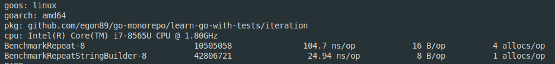

# Learn Go with Tests

[Site](https://quii.gitbook.io/learn-go-with-tests)

```bash
# run all tests
go test -v ./...

# run tests in a specific package
go test ./hello-world

# run benchmarks
go test -bench=.

# run from the root
go test ./... -bench=.

# run benchmarks with memory allocation stats
go test ./... -bench=. -benchmem

# run specific test
go test -run TestAreaTableDrivenTests/Rectangle
```

## Iterate benchmark test
`Strings` in Go are immutable, meaning every concatenation, such as in our Repeat function, involves copying memory to accommodate the new string. This impacts performance, particularly during heavy string concatenation.

The standard library provides the `strings.Builder` type which minimizes memory copying.



The `-benchmem` flag reports information about memory allocations:
- B/op: the number of bytes allocated per iteration
- allocs/op: the number of memory allocations per iteration

## Go Coverage tool
The Go toolchain includes a built-in [coverage tool](https://go.dev/blog/cover) that helps you identify which parts of your code are tested by your tests. To use it, you can run:

```bash
go test -cover ./...
```

## var keyword
The var keyword allows us to define values global to the package.
